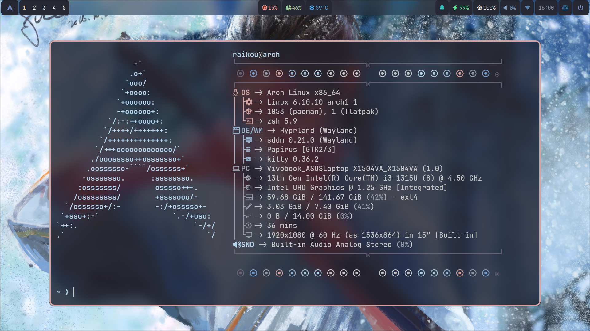

    <h1>Raikou Hyprland Dotfiles</h1>

❗❗❗THIS IS NOT FINISHED HYPRLAND DOTFILES❗❗❗

## SOFTWARE

- **Operation System**: <a href="https://archlinux.org/">Arch Linux</a>
- **Compositor**: <a href="https://hyprland.org/">Hyprland</a>
- **Status Bar**: <a href="https://github.com/Alexays/Waybar">Waybar</a>
- **Terminal**: <a href="https://sw.kovidgoyal.net/kitty/">Kitty</a>
- **Launcher**: <a href="https://hg.sr.ht/~scoopta/wofi">Wofi</a>

## TODO

- [ ] Finish waybar config, because it's looking so awful.
- [ ] Replace waybar with ags widget bar.
- [ ] Replace notifications with ags widget notification.
- [ ] Create some ags widgets like launcher, logout and etc.
- [ ] Create an installation shell script.
- [ ] Try to add material colors.
- [ ] Choose normal font.